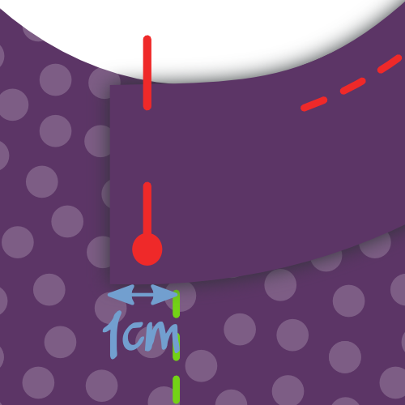
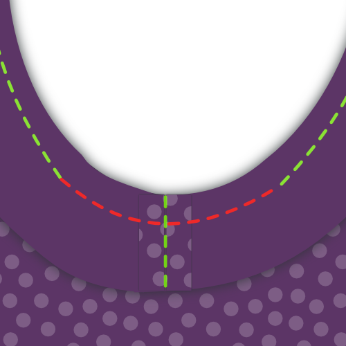

## Paso 1: Cerrar costuras

Pon delantero y de vuelta sobre el otro con _buenos lados juntos_. Sew the side seams and the short seams at the shoulder straps. If you have a serger, this is a good moment to use it. If not, finish your seams otherwise.

## Paso 2: Termina la lluvia

Doble la lluvia hacia arriba, y coser hacia abajo. Si tienes una cubierta, úsala. Si no, usa una _aguja gemela_ o _zig-zag stitch_ para mantener la costura estirable.

<Note>

##### Doblar solo una vez, para evitar el grueso
El brillo no se cuelga, así que puede doblar esto una vez y coser la tela, luego recortar la tela.

</Note>

## Paso 3: Acercar unión de tejidos al frente

<Note>

##### Acerca de la vinculación de knit

Si eres nuevo en [enlace de knit](/docs/sewing/knit-binding), puedes leer [esta página sobre el tema](/docs/sewing/knit-binding).

###### Repetir los pasos 3 y 4 para ambos brazos y la apertura del cuello

El procedimiento que se describe a continuación se aplica tanto a los agujeros de armadura, como a la abertura del cuello. En otras palabras, tendrá que hacerlo tres veces.

###### Empieza con la apertura más simple

Te aconsejo empezar con cualquier apertura que tenga la curvatura más uniforme. Por defecto, estos son los orificios del brazo, pero si cambió las opciones de patrón (piense en el acertijo) que podría no ser el caso.

En cualquier caso, cuanto menos afiladas sean las curvas, más fácil será. Así que comience con eso a calentarse antes de hacer las curvas más complicadas.

</Note>

We are going to finish the arm and neck hole with [knit binding](/docs/sewing/knit-binding) (note: not a knit band. Hay una diferencia, y se explica [aquí](/docs/sewing/knit-binding)).

<Note>

Esta es la única parte de hacer esta camisa que requiere un poco de práctica. No te preocupes, todo lo que tienes que hacer es hacer un par de estos y serás un profesional en poco tiempo.

</Note>

### Elige tu lugar

Lo primero que tenemos que hacer es decidir dónde vamos a empezar/detener nuestro vinculante. Esto es lo que sugiero:

  - Para los orificios de armadura: en la costura lateral. Esto ocultará nuestra costura bajo el brazo
  - Para la apertura del cuello: el centro de la parte trasera del cuello. Puede que quieras marcar esto con un pin

### Colocar (el inicio de) tu vinculación

Pon tu camisa A-abajo con el lado bueno, y coloque su tira de unión en la parte superior con el lado bueno hacia abajo (como en los lados buenos juntos).

Alínea el largo borde de tu tira con el borde de tu tela para que la tira se encuentre en la parte superior de la tela (no en la abertura). Coloque la esquina en su punto de partida.

Ahora desplaza tu tira de unión de 1 cm más allá de tu punto de partida. Este pequeño extra garantizará que podamos unirnos a los dos fines más adelante.

### Asegúrate de saber dónde coser

Vamos a coser a 1,5 cm del borde. Así que tenga cuidado, porque no se trata de la franquicia de costura estándar.

<Tip>

La forma más fácil de mantener esta distancia de 1,5 cm es utilizando una gauga de costura. 
O haga lo que hago, coloque una cinta de marcado en su máquina de coser y marque una línea en ella a 1,5 cm de su aguja. 
Entonces todo lo que tienes que hacer es mantener alineado el borde de tu tela con esa línea.

</Tip>

Además, no estamos empezando en nuestro punto de partida, pero nos saltamos la primera 3cm. Necesitaremos esta sala de pelucas más tarde para unirnos a los extremos de nuestra vinculación.

### Marcar enlace en su lugar

Mantenga su unión en su lugar mientras estira suavemente el encuadernador, pero no la tela. Asegúrate de no coser los últimos 3 cm pero déjalos, como hiciste al comienzo.

Es posible que necesites practicar un poco para tener el colmillo.

> Asegúrate de estirar más tu unión cuando estés tomando una curva más nítida. Lee mis notas sobre [enlace de tejidos](/docs/sewing/knit-binding) para más información.

### Marcar como enlace

Con alrededor de 6 cm para ir antes de completar nuestro círculo, es hora de coser los extremos de la unión juntos.

Tome uno de los bordes y lo estire a lo largo de los 3 cm separándola desde el punto de partida como lo haría mientras se coser.

Marque el enlace donde llegue al punto de partida. Haga lo mismo con el otro extremo.

### El encuadernado finaliza juntos

Doblar tu camisa de cualquier manera te hace más fácil colocar ambos extremos de unión con buenos lados juntos, alineando las marcas. Consume a ellos juntos en la marca.

> 6 cm no es mucho, pero debe ser suficiente para conseguir que ambos bordes cómodamente debajo de su máquina de coser para coser togther.

### Terminar los últimos 6 cm de encuadernado

Ahora que los extremos de la unión están unidos, es hora de terminar los últimos 6 cm de encuadernación. Manténgalo abajo, permaneciendo a 1,5 cm del borde como lo hiciste antes.

## Paso 4: Doble unión de tejidos a la espalda y coser

### Doblar tu unión sobre el borde de la tela hacia atrás

Doblar tu tela de unión alrededor de la tela de tu camisa A-hacia la espalda. Así es como lo costaremos.

> Mientras que la tela está doblada en la parte delantera (ocultando el borde de la tela en el proceso) no hay necesidad de eso en la parte trasera. Nos limitaremos a recortar el borde más tarde, dado que el nudo no se cuelga. Si tuviésemos que doblar la tela también en la espalda, sólo añadiríamos granel.

### Explora tu vinculación

Desde el lado derecho de tu tejido, coser a lo largo del borde interior de tu unión (más alejado del borde), asegurándose de capturar el enlace en la espalda en el proceso.

<Note>

Si tienes una máquina de cierre, eso sería perfecto para esta costura

</Note>

Tendrás que, una vez más, estirar tu vinculación un poco mientras haces esto. Pero esta vez, hay una advertencia adicional para mirar.

<Note>

##### Cuidado con el alimento desigual
mientras alimentas tu unión a través de tu máquina de coser, los perros de alimentación tirarán hacia adelante la capa inferior (parte trasera de su enlazamiento). 

En un mundo perfecto, todas las capas seguirán sin problemas. 
Pero la mayoría de las veces la capa superior (frontal de su enlace) tiende a retrasarse un poco. 
Esto hace que su unión no se pliega bien alrededor del borde del tejido, sino que haga tortillas feas.

Así que ten cuidado con esto, y si ves que sucede, estira la capa inferior un poco más para compensar.

</Note>

## Paso 5: Recortar unión de tejidos en el interior

En el interior de tu camiseta, recorta el enganche contra tu costura para acabar.

<Note>

Ten cuidado de no cortar un agujero en tu camiseta. Me ha ocurrido esto en más de una ocasión.

</Note>

