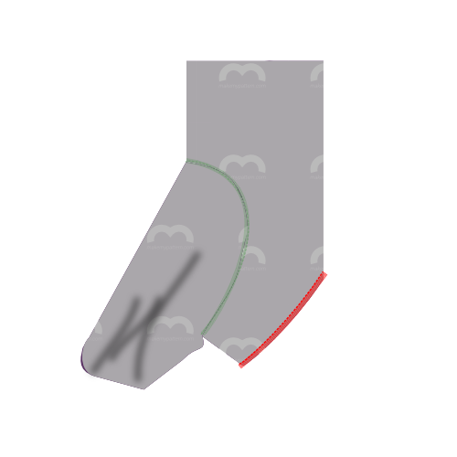
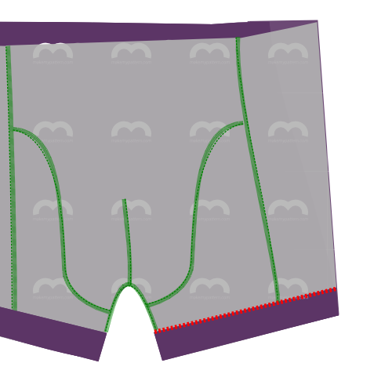

- - -
title: "Bruce boxer briefs: Sewing Instructions"
- - -

<YouTube id='PL1gv5yv3DoZME1xe5fBEHd0rKPW_xNpF3' playlist />

### Stap 1: Bevestig rugpand aan eerste zijkant

Align the side of the back (piece 1) with the side (piece 3) making sure to put the good sides together. The side (piece 3) is not symmetric, so make be careful to correctly match them.

<Tip>
If you look at the part 3 (the side) with the text so you can read it, then then left side should be attached to the back,
and the right side attached to the front & inset. The notches will also help you figure it out.
</Tip>

Serge them together, taking into account that the seam allowance is 1cm. So aim the outside needle of your serger 1cm from the edge of your fabric.

> Als het metrieke stelsel niet je ding is, 1 cm is 3/8 inch.

> Sommige overlock hebben een hendel om te kiezen tussen platte naden of gebundelde naden. Als je van plan bent om sierstiksels te gebruiken (zie stap 6), kies dan zeker voor platte naden.

### Stap 2: Bevestig rugpand aan tweede zijkant

Align the other side of the back (piece 1) with the second side (piece 3) making sure to put the good sides together. Since the side (piece 3) is symmetric, you can't go wrong.

Serge them together, as you did on the other side.

> Het rugpand en de zijkanten zijn nu aan elkaar bevestigd. Leg ze even opzij terwijl we ons focussen op de andere stukken.

### Stap 3: Bevestig inzetstukken aan voorkanten

  

Joining the inset (piece 4) with the fronts (piece 2) requires you to serge them together across their curvy edges.

> Onthou dat je twee voorpanden hebt. Je moet deze bovenop elkaar leggen en als één dubbel gelaagd voorpand verwerken.

Faced with a tricky seam like this, you might reach for your pins or basting thread, but don't. Pinning or basting this will make it harder to sew.

Instead, start at the top of the curved seam, aligning the pieces as shown, and slowly serge them together a few cm.

As you move along, manipulate the fabric to make sure both edges stay on top of each other as you feed them through your serger.

As you manipulate the fabric to get it aligned properly, it's easy to stretch one part more than the other. The notch in the curved edge can help you make sure you're keeping things even.

Once you've passed the notch, things will get easier. This would also be a good time to compare the remaining length of the curved seams. If one is a bit longer than the other, simply stretch the shorter one until they match up.

If the difference is too big however, just leave it. It will get cut off when we do the crotchseam.

<Note>

Dit is zo ongeveer de moeilijkste naad in het patroon. Doe rustig aan, en alles komt goed.

</Note>

<Tip>

###### Of sluit deze naden aan door ze tussen de voorpanden te sandwich

terwijl het nog wat meer werkt, Je kan deze naad omklappen als je de insets eerst naar één van de voorpanden driegt,
en stik dan je voorpanden samen met de ingezette zakken in zwang binnen.

Naai de nepen vooraan apart en keer alles binnenstebuiten, en je hebt een mooi naadloos pakketje vooraan.

</Tip>

### Stap 4: Bevestig tweede inzetstuk en voorkanten

After you have joined the first inset and the fronts, continue with the second one.

With the fronts and insets joined together, you are left with 3 parts:

- De inzetstukken en voorpanden, aan elkaar bevestigd
- De zijkanten en rugpand, aan elkaar bevestigd
- De elastiek

### Stap 5: Sluit de neep in de voorpanden

Fold the fronts double along the center fronts line, so that the tusks at the bottom line up.

Serge the sides of the tusks to close the fronts dart. For best results, start at the top of the seam (where the fabric is folded) and work your way to the bottom.

<Tip>

###### Houd die naad weg van mijn ...

Een andere optie is op de neep aan elk voorpand apart te naaien zodat de naden aan de binnenkant zitten.
Het is iets meer werk, maar het is het extra comfort meer dan waard.

</Tip>

### Stap 6: Optioneel: Sierstiksel

<Note>

Deze stap is optioneel. Sierstiksel voegt een visueel effect toe dat de individuele patroondelen benadrukt.
Het is een leuke manier om een effen stof visueel op te breken, maar als je een print gebruikt of verschillende kleuren, laat je het misschien beter.

</Note>

If you want to topstitch your serged seams for visual effect, you should do so now.

If you topstitch, simply do it for every seam, making sure to do so with a flexible stitch. You can use a zig-zag stitch or twin needle if you don't have a coverlock or specific flexible stitch setting.

<Tip>

Stik de naad die de voorste neep dicht, en begin vanaf de onderkant,
en laat de sierstiksel helemaal naar boven lopen, waar de tailleband komt.
De naad stopt halverwege (waar de neep eindigt), maar je stiksel moet doorlopen.

</Tip>

### Stap 7: Bevestig de eerste zijkant aan de voorpanden

Align the side edge of the first side with the edge made up of the fronts+inset (good sides together as usual) and serge them together.

### Stap 8: Bevestig de tweede zijkant aan de voorpanden

Do the same for the second side.

### Stap 9: Optioneel: Sierstiksel

If you've topstitched before, make sure to do the same now for the seams you made in step 7 and 8.

### Stap 10: Werk de kruisnaad af

We will now serge the arched opening in the back part to the front parts of the boxers, made up of the fronts and insets.

The notches on the back piece will help you. There's the center notch, and the other two notches should match up with where the fronts and inset pieces are joined.

<Tip>

Het is makkelijker om in het midden te beginnen en één kant af te werken. Begin dan opnieuw in het midden om de andere kant af te werken.

Neem het langzaam, en wees **zeer bewust** waar je overlock in snijdt.

</Tip>

### Stap 11: Zoom de eerste pijp

Time to hem the legs. Hem them as you would do any other stretchy knit. Go for a flexible stitch. You can use a zig-zag stitch or twin needle if you don't have a coverlock or specific flexible stich setting.

<Note>

Ik vind zomen veel eenvoudiger als je de dingen eerst op de juiste plek speldt.
Dus plooi je zoom om, en speld alles op z'n plaats.
Nog beter: speld beide pijpen vast en naai pas als je vindt dat het er goed uitziet.

</Note>

### Stap 12: Zoom de tweede pijp

You know it makes sense.

### Stap 13: Maak een lus van je elastiek

Sew both ends of your elastic together with good sides together.

<Note>

###### Niet zeker hoeveel elastiek je nodig hebt?

Ruim je elastiek rond je taille om waar het zou komen te zitten, en strak hem aan tot hij zich juist voelt.
Duid aan waar dat punt is, voeg 2 cm naadwaarde toe, en daar is je lengte.

</Note>

### Stap 14: Bevestig elastiek aan de taille

Attach the elastic to the waist.

Do so good sides together if you're using a flexible stitch or twin needle on a conventional sewing machine.

If you're using a coverlock, put the elastic on top of the good side of the fabric.

<Tip>

De lengte van je elastiek is waarschijnlijk niet hetzelfde als de lengte van je stof, aangezien de twee op een andere manier uitrekken.
Een paar spelden helpen om alles gelijk te krijgen.

Verdeel zowel je elastiek als de taille van je boxershort in 4 (of 8) gelijke delen. Speld elastiek en stof samen op deze punten.

Tijdens het naaien rek je de elastiek en de stof tussen elke speld, verwijder de spelden terwijl je verder beweegt.

</Tip>

### Stap 15: Knip bij en kuis op

Trim any excess fabric you might have at elastic or hem, and any loose threads.
