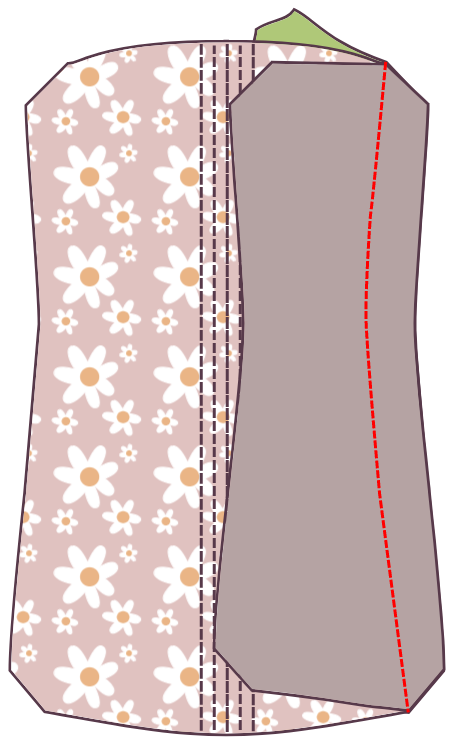

<Note>

#### Es gibt viele Möglichkeiten, ein Korsett zu konstruieren

Diese Anleitung ist nur eine davon. Bei dieser Methode empfehle ich eine breitere Nahtmenge von mindestens 1,5cm zu verwenden, damit Ihre Knochenkanäle bequem in die Nahtzufuhr passen.

Hersteller von Anfängerkorsetten sollten die Tutorials lesen, die von [Sidney Eileen](http://www.sidneyeileen.com), die verschiedene Baumethoden demonstrieren, geschrieben wurden. [Foundations Revealed](https://www.foundationsrevealed.com) ist eine Paywall-Website für Korsettmacher, mit einigen außergewöhnlichen Artikeln kostenlos für Nichtmitglieder.

#### Check the original tutorial

This pattern is based on [this tutorial by Cathrin Alen](https://katafalk.wordpress.com/2010/06/24/underbust-pattern-tutorial/). Cathrin hat auch [diesen informativen Beitrag über das Erstellen von Korsetten](https://katafalk.wordpress.com/2009/05/03/how-i-sew-corsets/) in ihrem Blog, den Sie vielleicht hilfreich finden.

</Note>

## Schritt 1: Nähen der Knochenkanäle in der Mitte vorne

Beginnen Sie mit den Vorderteilen in der Mitte. Für einen 11 Panel Cathrin wird dies Panel 1 sein. Platzieren Sie das äußere Panel 1 auf dem Kernpanel 1, schlechte Seiten zusammen.

Mit einer kleinen Nähbreite (ich setze Mine auf „2“), nähen Sie eine Linie gerade in der Mitte vorne. Dann Nähen Sie zwei Knochenkanäle zu beiden Seiten, so dass ein bisschen mehr Platz, etwa 2mm, zusätzlich zur Breite Ihrer Knochen.

## Schritt 2: Füge das erste Seitenpanel hinzu

Nimm das nächste Stück. Für einen Cathrin mit 11 Panels wird dies Panel 2 sein.

Platzieren Sie das äußere Panel 2 auf der äußeren Leiste 1, _gute Seiten zusammen_.

Platzieren Sie das Core Panel 2 auf dem Core Panel 1, _gute Seiten zusammen_.

Vergewissern Sie sich, dass die vier Schichten des Stoff perfekt sind. Überprüfen Sie doppelt, ob Sie keine Musterstücke vermischt oder versehentlich gekippt haben.

Passen Sie die vier Stoffschichten im engsten Teil an, _gute Seiten zusammen_, und pin. Dann passen Sie oben und unten auf jeder Platte und Pin. Schließlich den Rest der Kante anpinnen. Verwenden Sie so viele Pins wie nötig, um sicherzustellen, dass die Platten perfekt aufeinander abgestimmt bleiben.

Nähen Sie die Naht.

## Schritt 3: Nähen Sie den Knochenkanal

Drücken Sie beide Schichten des Paneels 2 weg vom Zentrum, mit Hilfe des Eisens, um das Material zu erleichtern, in dem die Nähte kurven.

Edgestitch rechts an der gefalteten Kante, nur 1-2 mm von der Nahtlinie. Langsam nähen und die Nähung im Auge behalten, um zu gewährleisten, dass die Distanz auch zu jeder Zeit gehalten wird. Der Zweck dieser Topstitch-Linie ist es, Stress von der Verbindungsnaht zu lindern.

Topstitch eine weitere Naht parallel zur ersten Naht, so dass ein bisschen mehr Platz, etwa 3 mm zusätzlich zur Breite des Knochens.

## Schritt 4: Füge das nächste Panel hinzu

Nimm das nächste Stück. Für einen 11 Panel Cathrin wird dies Panel 3 sein.

Platzieren Sie das äußere Panel 3 auf der äußeren Leiste 2, _gute Seiten zusammen_.

Platzieren Sie das Core Panel 3 auf dem Core Panel 2, _gute Seiten zusammen_.

Passen Sie die vier Stoffschichten im engsten Teil an, _gute Seiten zusammen_, und pin. Dann passen Sie oben und unten auf jeder Platte und Pin. Schließlich den Rest der Kante anpinnen. Verwenden Sie so viele Pins wie nötig, um sicherzustellen, dass die Platten perfekt aufeinander abgestimmt bleiben.

Nähen Sie die Naht.

## Schritt 5: Ein weiterer Knochenkanal nähen

Drücken Sie beide Schichten des Paneels 3 weg vom Zentrum, mit Hilfe des Eisens, um das Material, wo die Nähte Kurve zu erleichtern.

Edgestitch rechts an der gefalteten Kante, nur 1-2 mm von der Nahtlinie.

Topstitch eine weitere Naht parallel zur ersten Naht, so dass ein bisschen mehr Platz, etwa 2mm zusätzlich zur Breite des Knochens.

Dieser neue Knochenkanal sollte genauso aussehen wie der, den Sie mit Paneel 2 an Panel 1 angebracht haben.

## Schritt 6: Anhängen der Seitenleiste fortsetzen

Fügen Sie die Paneele weiter an und erstellen Sie einen Knochenkanal in jeder Naht. Greifen Sie Panel 4 zu Panel, Panel 5 zu Panel 4, und schließlich Panel 6 zu Panel 5.

Wiederholen Sie diese Schritte auf der anderen Seite.

## Schritt 7: Fertige das Korsett zurück

Wenn alle Ihre Paneele angeschlossen sind, arbeiten Sie mit den flachen Seiten jedes Paneels 6.

Falten Sie die Nahtgenehmigung für beide Teile nach innen, so dass die Nahtzuweisung versteckt ist. Drücken Sie flach, dann obere Stich in der Nähe der Kante.

Topstitch eine weitere Naht neben der Kantennaht, die ein wenig mehr Platz lässt, etwa 2 mm zusätzlich zur Breite des Knochens.

Markiere die Standorte deiner Stummme. (Fügen Sie sie noch nicht ein. Markiere einfach den Stoff, wo du sie platzierst, und stelle sicher, dass du einen Streifen erstellst, der für die Breite deiner Gromme geeignet ist.)

Top Stich auf der gegenüberliegenden Seite der Grommet Markierungen, Dann verschieben und sticken Sie eine weitere Naht parallel zur aufgesteppten Naht und lassen Sie wieder genügend Platz für den Knochen.

Wiederholen auf der anderen Seite.

## Step 8: Insert boning

Füge Knochen in allen Kanälen ein.

## Schritt 9: Oben und unten binden

Verwenden Sie Bias-Band oder Band, um die oberen und unteren Kanten des Korsetts zu binden.

## Schritt 10: Legen Sie die Grommets fest

Legen Sie die Grommets in den Positionen fest, die Sie zuvor markiert haben.

## Schritt 11: Lasse das Korsett

Du bist fertig!
