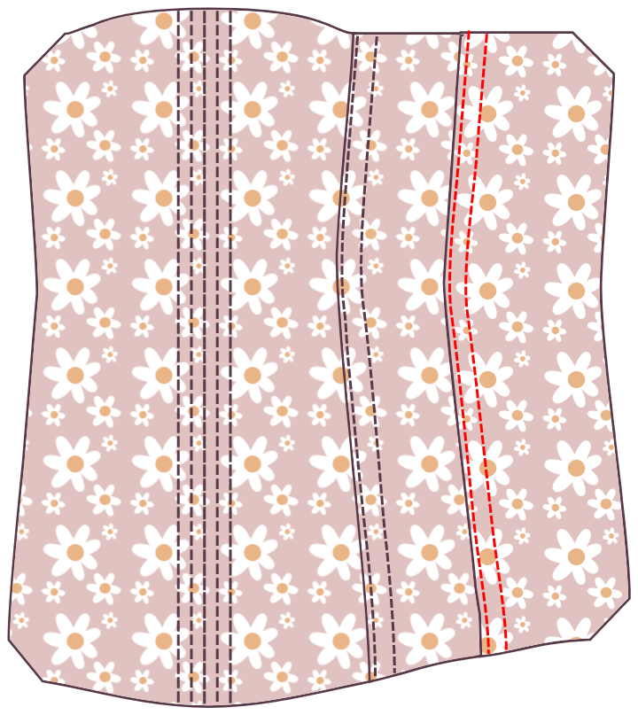

<Note>

#### Hay muchas maneras de construir un corsé

Estas instrucciones son sólo una vía. Con este método, recomiendo el uso de una mayor franquicia de costura de al menos 1,5 cm para que sus canales de hueso encajen cómodamente dentro de la franquicia de costura.

Los creadores de corset principiantes deberían leer los tutoriales escritos por [Sidney Eileen](http://www.sidneyeileen.com), que demuestra varios métodos de construcción diferentes. [Foundations Revealed](https://www.foundationsrevealed.com) es un sitio de paywall para los creadores de corsets, con varios artículos excepcionales gratuitos para los no miembros.

#### Consulta el tutorial original

Este patrón está basado en [este tutorial de Cathrin Alen](https://katafalk.wordpress.com/2010/06/24/underbust-pattern-tutorial/). Cathrin también tiene [esta publicación informativa sobre la creación de corsets](https://katafalk.wordpress.com/2009/05/03/how-i-sew-corsets/) en su blog que tal vez te parezca útil.

</Note>

## Paso 1: Aumentar canales huesos en el frente central

Comience con las partes frontales del centro. Para una Catedral de 11 paneles, este será el Panel 1. Coloque el Panel externo 1 en el Panel central 1, los lados malos juntos.

Con un pequeño ancho de banda (pongo la mina en “2”), coser una línea recta por el frente central. Luego coser dos canales de hueso a ambos lados, permitiendo un poco de espacio extra, unos 2mm, además del ancho de su hueso.

## Paso 2: Adjuntar el panel del primer lado

Tome el siguiente trozo. Para una catedral de 11 paneles, este será el Panel 2.

Coloca el Panel externo 2 en el Panel externo 1, *lados buenos juntos*.

Coloca el Panel 2 del núcleo en el Panel del núcleo 1, *buenos lados juntos*.

Asegurar que las cuatro capas de tejido se alinean perfectamente. Compruebe dos veces que no haya mezclado piezas de patrón o volteado ninguna por error.

Haz coincidir las cuatro capas de tela en la parte más estrecha, \_lados buenos juntos\_y pin. Luego, haz coincidir la parte superior e inferior de cada panel y pin. Finalmente, anclar el resto del borde en su lugar. Utilice tantos pines como sea necesario para asegurarse de que los paneles permanecen perfectamente alineados.

Difunde la costura.

## Paso 3: Pase el canal de hueso

Presione ambas capas de Panel 2 lejos del centro, utilizando el hierro para aliviar el material donde la curva de las costuras.

Edición a lo largo del borde doblado, a sólo 1-2mm de la línea de costura. Diviértete lentamente y vigila la cinta para asegurar que la distancia se mantenga incluso en todo momento. El propósito de añadir esta línea superior es aliviar el estrés de la costura conectada.

Topstitch otra costura paralela a la primera costura, permitiendo un poco de espacio extra, unos 3 mm, además de la anchura de su hueso.

## Paso 4: Adjuntar el siguiente panel

Tome el siguiente trozo. Para una Catedral de 11 paneles, este será Panel 3.

Coloca el Panel externo 3 en el Panel externo 2, *lados buenos juntos*.

Coloca el Panel de núcleo 3 en el Panel de núcleo 2, *buenos lados juntos*.

Haz coincidir las cuatro capas de tela en la parte más estrecha, \_lados buenos juntos\_y pin. Luego, haz coincidir la parte superior e inferior de cada panel y pin. Finalmente, anclar el resto del borde en su lugar. Utilice tantos pines como sea necesario para asegurarse de que los paneles permanecen perfectamente alineados.

Difunde la costura.

## Paso 5: Empuja otro canal de huesos

Presione ambas capas del Panel 3 lejos del centro, utilizando el hierro para aliviar el material donde la curva de las costuras.

Edición a lo largo del borde doblado, a sólo 1-2mm de la línea de costura.

Topstitch otra costura paralela a la primera costura, permitiendo un poco de espacio extra, alrededor de 2mm, además de la anchura de su hueso.

Este nuevo canal de huesado debería ser igual al que hiciste adjuntar Panel 2 al Panel 1.

## Paso 6: Continuar adjuntando los paneles laterales

Continúa adjuntando paneles, creando un canal de hueso en cada costura. Adjunte el Panel 4 al Panel, el Panel 5 al Panel 4, y finalmente el Panel 6 al Panel 5.

Repita estos pasos en el otro lado.

## Paso 7: Termina el corsé de vuelta

Con todos tus paneles conectados, estás trabajando con los lados planos de cada Panel 6.

Doblar la provisión de costura de ambas piezas hacia adentro para que la provisión de costura esté oculta. Presione plano, y la parte superior se tira cerca del borde.

Topstitch otra costura junto a la costura edestificada, permitiendo un poco de espacio extra, unos 2mm, además de la anchura de su hueso.

Marque las ubicaciones de sus grommets. (No los insertes todavía. Simplemente marca el tejido donde los colocarás y asegúrate de crear una tira adecuada al ancho de tus grommets.)

Más arriba en el lado opuesto de las marcas grommet, luego desplazarse y doblar otra costura paralela a la costura de la parte superior, dejando de nuevo suficiente espacio para el hueso.

Repetir en el otro lado.

## Step 8: Insert boning

Insertar huesos en todos los canales.

## Paso 9: Vincula la parte superior e inferior

Usa cinta o cinta de sesgo para unir los bordes superiores e inferiores del corsete.

## Paso 10: Establecer los grommets

Establecer los grommets en las ubicaciones que marcó anteriormente.

## Paso 11: Laza el corsé

¡Has terminado!
