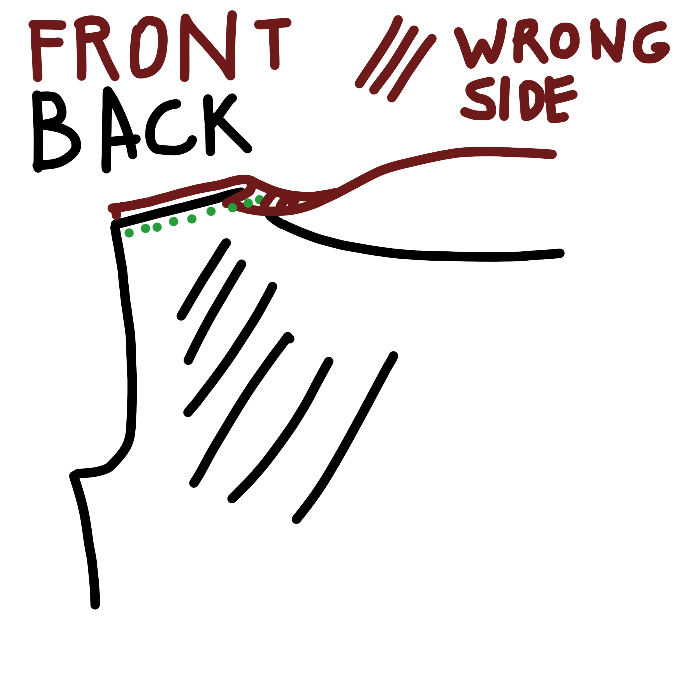

### Step 1: Finish the back neckline

- Cut a strip of main fabric the length of your back neckline, and around 3 cm wide.
- Press a fold into this strip, 1 cm from the edge.

<Tip>

For woven fabric make this a bias cut strip.  
For knit fabric make a strip with the stretch of the fabric running along the long edge.

</Tip>

- With *good sides together* align the non-folded edge of the strip with the back neckline.
- Sew the strip to the back neckline and trim the seam. 
- Turn the strip to the wrong side of the fabric and *topstitch* along the folded edge to keep it in place.

### Step 2: Close shoulder seams

- Finish the raw edge on the front neckline in a way that suits your fabric (if it doesn’t fray, you can leave it unfinished).
- With *good sides together*, place the front on the back aligning the shoulder seams.
- Fold the front neckline seam allowance over to the wrong side of the back.

<Note>

If you have a lightweight woven fabric you can fold this edge up again, so it will form a narrow double hem afterwards (it can help to press these folds first).

</Note>

- Stitch the shoulder seam, enclosing the raw edge of the back neckline in the fold.
- Turn to the right side and press.

### Step 3: Finish front neckline

- Press the hem formed in your fabric by the folds you made at the shoulder seam when you closed the shoulder and topstitch close to the edge.
 
### Step 4: Attach sleeves

The sleeve will be inserted flat, meaning the armhole seam will be sewn first and the sleeve and side seam will be closed in one go.

- With *good sides together*, matching notches, pin the sleeve head along the armhole.
- If necessary, ease in the sleeve head at the top, between the notches.
- Sew, finish and press the seam.
- Repeat for other sleeve.

### Step 5: Close side and sleeve seam

- With *good sides together* pin the front to the back along the sleeve and side seams, making sure to line up the armhole seams.
- Sew, finish and press the seam.

### Step 6: Hem

- Finish the sleeves and bottom hems in a way that works with your fabric choice. 

<Note>

Again, this can mean folding the hem under twice and *topstitching*, finishing the raw edge with a serger
or zig zag stitch and folding it under once or leaving the edge raw, folding it under once and
trimming close to the stitching.

</Note>

### Step 7: Enjoy!

You're all done! Now go enjoy your new top!
