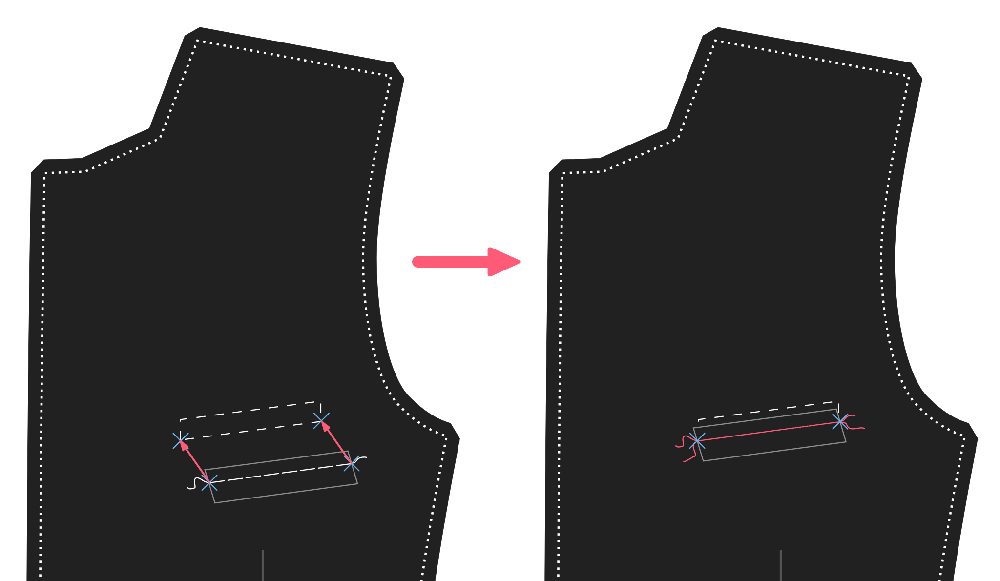
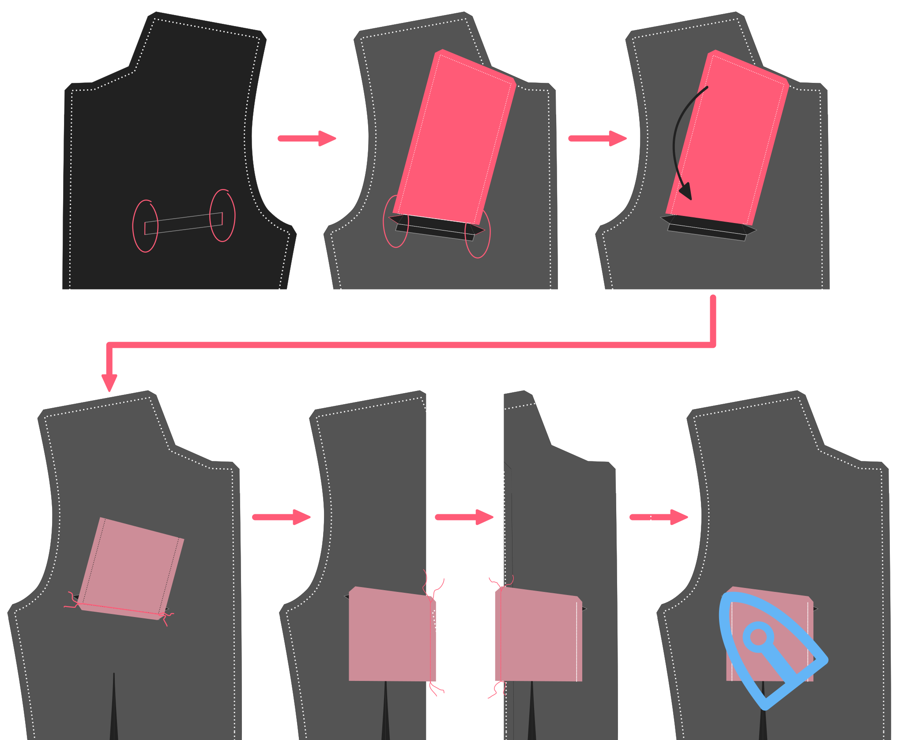
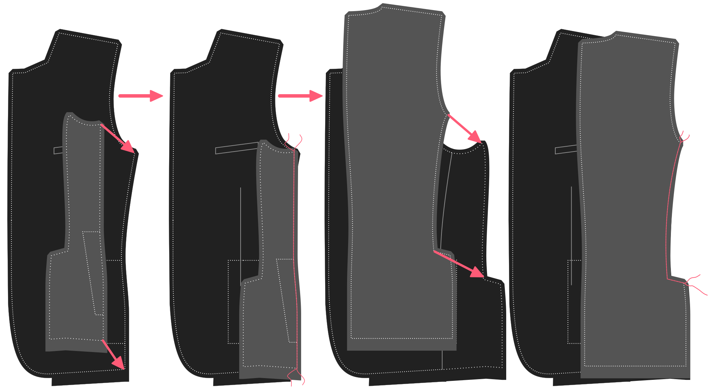
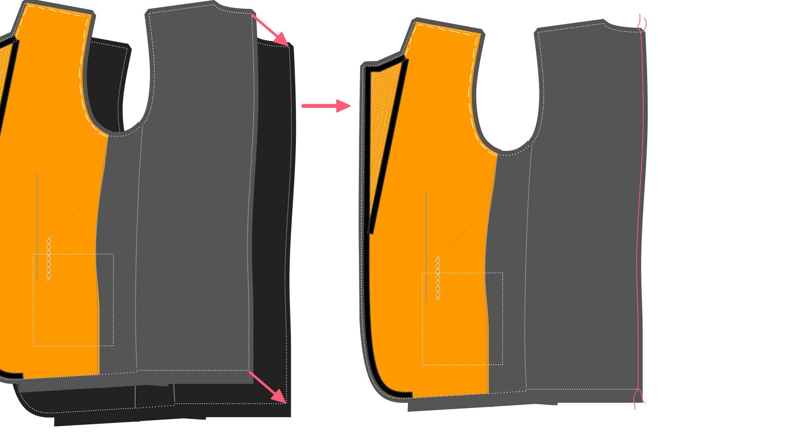

<Note>

###### Jaeger documentatie is in constructie

Deze documentatie is nog niet klaar.

</Note>

## Constructie

### Sluit de voorste nepen

#### Vouw dubbel

Vouw het voorpand dubbel met de goede kanten tegen elkaar en speld het vast zodat de vouw net in het midden van de voorste neep zit.

#### Stik de nepen

Stik de voorste neep dicht, let op dat de neep bovenaan op de juiste hoogte stopt. De onderkant is niet zo belangrijk aangezien die bedekt wordt door de zakken. Maar het bovenste puntje van de neep blijft zichtbaar, dus zorg dat ze aan beide kanten exact even lang zijn.

#### Knip open en strijk

Zodra de voorste nepen dichtgestikt zijn, knip je ze open aan de achterkant. Je zal niet helemaal tot in de punt kunnen knippen, maar dat is ok. Strijk de nepen open waar ze opengeknipt zijn, en strijk de rest opzij. Strijk alleen op de achterkant. Strijken op de voorkant kan sporen achterlaten op je stof.

### Maak de borstzak

#### Bevestig kleefbare tussenvoering

Kleef een rechthoekig stukje tussenvoering aan de verkeerde kant van de plek waar de borstzak komt, iets groter dan de aangegeven zakopening.

> ##### We plakken niet het hele voorpand vol
>
> Sportieve jasjes worden meestal gemaakt van iets zwaardere stoffen. Dat, en het feit dat ik liever canvas gebruik in plaats van fusibele tussenvoering, betekent dat ik de voorkant niet met nutteloos draait.

#### Drieg de omtrek van de bies, markeer de eindpunten van de bovenrand

Als de tussenvoering juist hangt drieg je rondom de borstzak om de markeringen over te zetten op de goede kant van de stof.

Deze zak is een beetje verschillend van een klassieke paspelzak. De paspel komt iets voorbij de zakopening. Dit verbergt het binnenste zakdeel zonder dat je een beleg nodig hebt. De bovenrand van de zakopening is ook kleiner dan de paspel, waardoor je hem onzichtbaar met de hand kan vastzetten.

Vertrek vanaf de bovenste lijn van je gedriegde paspelzak, en markeer vanaf de hoeken van deze lijn 0,5 cm naar binnen toe.

> Deze punten zijn merktekens op het voorpand van je patroon.

#### Vouw, strijk en stik de zijnaden van de paspel

Vouw de paspel dubbel met de goede kanten op elkaar, en sluit de zijkanten (naai de zijnaden).

#### Knip naadwaarde bij, keer en strijk

Knip de naadwaarde aan de zijkant bij, vooran aan de hoekjes, om bulk te voorkomen.

Keer naar de goede kant en strijk plat.

> Wees voorzichtig dat je niet te hard strijkt aangezien je aan de goede kant werkt.

#### Drieg de onderrand van de paspel zodat je weet waar te naaien

Drieg een gidslijn aan de onderrand van de paspel om aan te gevel waar de grens is tussen paspel en naadwaarde. Op deze lijn wordt later gestikt.

#### Stik de paspel aan het voorpand

Leg de paspel op de goede kant van het voorpand met de plooi naar onder toe gericht, en stik vast aan de onderste gemarkeerde lijn. Zorg ervoor dat je exact begint en eindigt op de lijn die je gedriegd hebt.

#### Stik het borstzakdeel aan het voorpand

Leg het zakdeel op het voorpand. Het voorpand met de goede kant omhoog, en het zakdeel met de foute kant omhoog. Zorg dat de langste zijde van het zakdeel op de hoogste kant van de borstzak ligt.

> Enkel schuine borstzakken hebben een hoge en een lage kant.

Stik vast langs de bovenste lijn. Denk eraan dat deze lijn korter moet zijn dan de onderste stiklijn om de paspel vast te maken, aangezien je vanaf de hoeken 0,5 cm naar binnen gemarkeerd hebt.

> Aangezien het zakdeel waarschijnlijk een glad stofje is, is het geen slecht idee dit op z'n plaats te spelden of driegen voor je het stikt.

#### Knip de zakopening, keer en strijk

 Knip nu je zakopening open tussen de twee stiklijnen. Knip niet tot aan de rand, maar in een hoek van 45° zodat je aan het uiteinde kleine driehoekjes krijgt.

Keer het zakdeel en de paspel naar de achterkant door ze door het gat te halen dat je net gemaakt hebt.

Leg alles mooi plat en strijk.

Breng nu enkel de paspel naar de voorkant en leg hem mooi plat. Strijk opnieuw langs de achterkant.

> Het is verleidelijk dit langs de voorkant te strijken, maar beheers jezelf.

#### Werk de borstzak af

Plooi het zakdeel dubbel en stik het aan de zak paspel onder de bestaande naadlijn van de paspel.

Neem naald en draad en werk de borstzak met de hand af door de zijkanten van de paspel onzichtbaar aan het voorpand vast te naaien.

Als laatste sluit je de binnenzak door de zijkanten dicht te stikken. Doe die door het voorpand neer te leggen met de goede kant naar boven. Vouw dan de zijkant naar boven en stik het zakdeel aan de twee kanten. Let op dat je die kleine driehoekjes aan de zakopening mee vastnaait. Dit verstevigt de zakopening.

Drieg de bortzak dicht terwijl je de rest van het jasje maakt.

### Bereid de voorpanden voor

Knip het voorpand uit een lichte en soepele haardoek, schuin van draad. Knip het volledige voorpand.

Knip de voorste neep uit en sluit plat met een zigzagsteek. Let op dat de randen niet overlappen, maar net tegen elkaar komen.

Knip het borststuk uit. Leg het langs de rollijn, en drieg op z'n plek op het voorpand in haardoek.

> Het borststuk is aangeduid op het voorpand van je patroon.

#### Drieg haardoek aan de voorpanden

Drieg nu de voorpanden in haardoek en het borststuk aan je voorpand. Denk eraan dat het haardoek geen naadwaarde heeft.

> Drieg het net voorbij de naadlijn zodat je het uit de weg kan plooien wanneer je deze naden stikt.\
> Je wil niet dat je haardoek mee in de naad zit.

#### Pikeer je revers

Tijd om je een echte kleermaker te voelen, en die revers te pikeren zoals ze nog nooit gepikeerd zijn.

Zorg dat de steken een beetje kleiner zijn tegen de tip van de revers om ervoor te zorgen dat het plat tegen de kist ligt te knippen een beetje naar binnen in plaats van naar buiten.

> Als je niet zeker weet hoe je de kippen stikt, [laat het ons weten](https://discord.freesewing.org/) en we doen een poging om het te documenteren.

#### Revers contouren en breuklijn

Nu gaan we met dunne keperband met de hand langs de rand van de revers naaien, alsook langs de breuklijn. Dit zal ook het haardoek hier en daar aan het voorpand bevestigen.

Onthoud:

*   Het lint langs de breuklijn moet binnen de breuklijn geplaatst worden.
*   Het lint langs de breuklijn moet ongeveer een halve centimeter korter zijn dan de afstand die het moet overbruggen. De lichte spanning op het lint zorgt dat de revers mooi rollen en zich naar je lichaam vormen.
*   Het lint langs de rand van de revers valt binnen de stiklijn

> ##### Naai niet door je stof
>
> Probeer je naald niet helemaal door de stof te duwen als je het lint vastnaait, zo vermijd je dat je steken zichtbaar zijn aan de buitenkant.
>
> Het is echter niet de bedoeling dat je het lint enkel aan het haardoek vastnaait. In plaats daarvan moet je proberen om elke steek een paar draadjes van je stof te halen. zodat de band vastzit en de steken niet zichtbaar zijn aan de voorkant.
>
> Dit is minder problematisch boven het breekpunt van de revers, waar de stof aan de achterkant komt te liggen.

### Sluit de naden

#### Stik de zijnaden

Leg je voorpanden neer met de goede kant omhoog, en je zijpanden erop met de goede kant omlaag.\
Leg de voor- en zijnaden gelijk, speld ze eventueel samen en stik.

Leg dit neer met de goede kant omhoog, en leg je rugpand hierop met de goede kant naar beneden.\
Leg de rug- en zijnaden gelijk, speld ze eventueel samen en stik.

> Let op dat het haardoek niet mee vastgestikt wordt.

> ##### Opmerking voor het naaien van splitten
>
> Als je een dubbele split hebt, zitten die in deze naad.
>
> Stik het deel van de zij- achternaad tot aan de split en het stukje naar opzij dat de split vormt. Stik niet verder naar beneden.

#### Sluit de achternaad

Leg de twee halve jasjes met de goede kanten op elkaar en stik de middenachternaad dicht.

<Note>

##### Let op voor het naaien van vents

Als je een enkele split hebt, zit deze naad in de vent.

Stik het deel van de achternaad tot aan de split en het stukje naar opzij dat de split vormt.
Stik niet verder naar beneden.

</Note>

#### Sluit de schoudernaden

Leg de schouders op elkaar met de goede kanten op elkaar en stik.

Let op dat het haardoek niet mee vastgestikt wordt.

<Note>

##### Leg de schoudermerktekens uit

Zorg ervoor dat de schouders op basis van de merktekens goed op elkaar worden afgestemd.
Vanwege de verschillende vorm van de achter- en voorpanden aan de nekzijde,
ziet de rand van de stof er anders uit. Dus het aanpassen van deze randen geeft je niet
wat je nodig hebt.

Dus zorg dat je op de merktekens afgaat. Daar dienen ze voor.

</Note>
