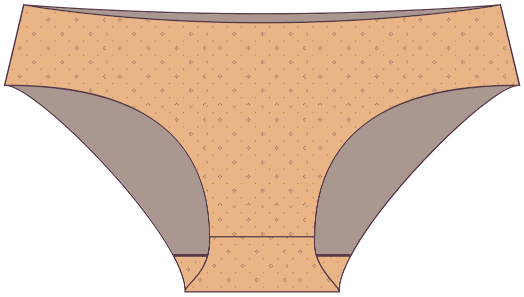

### Schritt 1: Nähe die Vorderseite an das erste Zwickel-Stück

Platziere eines der Zwickelstücke auf das Vorderteil, _gute Seiten zusammen_, so dass die Schritt-Nähte zueinander ausgerichtet sind. Stecke oder hefte an der Nahtzugabe.

### Schritt 2: Flach öffnen

Öffne die Naht flach. Du kannst die Naht bügeln, wenn du willst, aber wer bügelt Unterwäsche?

### Schritt 3: Nähe die Rückseite an das erste Zwickel-Stück

Lege die Rückseite an den Zwickel, gute Seiten zusammen. Stecke oder hefte an der Nahtzugabe.

### Schritt 4: Flach öffnen

Öffne flach.

## Schritt 5: Füge das zweite Zwickel-Stück hinzu

Bringe die Vorder- und Rückteile aus dem Weg, indem du sie in die Mitte rollst.

Platzieren Sie das zweite Gusset-Stück gute Seiten auf der Vorderseite, so dass es sich mit dem ersten Gusset-Stück anpasst. Die gerollten Vorder- und Rückenteile sollten zwischen Ihren Gusset Stücken abgemischt werden.

Nähen Sie die Nähte vorne und hinten mit einem Zickzackstich an Ihrer Naht.

## Schritt 6: Auf die richtige Seite wenden

Wende alles auf rechts. Alle Zwickel-Nähte sollten eingeschlossen sein.

### Schritt 7: Nähe die Seitennähte

Stecke die Seitennähte zusammen, gute Seiten zueinander. Nähe die Seitennaht an den Nahtzugaben mit einer Overlock oder Zickzack-Stichen.

<Note>

Gute Arbeit! Technisch könnte man die Kanten roh belassen, da Strickstoffe nicht zerfallen lassen aber damit Ihre Unsterblichkeit aufrecht bleibt, sollten Sie den Beinen und der Taille wahrscheinlich elastisch hinzufügen. Mach weiter.

</Note>

### Schritt 8: Gummibänder vorbereiten

Überlappen Sie die Kanten jedes elastischen Teiles durch Ihre Naht und Näht zusammen. Sie sollten drei elastische Stücke haben: eines für die Taille und zwei für die Beine.

Um die Elastik gleichmäßig zu dehnen, teilen Sie die Elastik in vier Viertel und markieren Sie die Punkte mit Pins oder Kreide. Gleiches gilt für die Taille und die Beinöffnungen, wobei die Viertelpunkte markiert werden.

### Schritt 9: Gummizug auf die äußere Seite nähen

Nähen Sie die elastische Taille und die Beinöffnungen auf der guten Seite des Stoffes und sorgen Sie dafür, dass Sie die Viertelmarkierungen anbringen. Wenn dein Elastisch einen dekorativen Rand hat, Vergewissern Sie sich, dass Sie die schlichte Kante (nicht die dekorative Kante) des elastischen an den Rand des Stoffes anbringen. Die dekorative Kante sollte auf das Kleidungsstück zeigen, nicht weg davon.

Nähen Sie das elastische Kleidungsstück mit einem Zickzackstich. Die elastische Nähte müssen Sie leicht dehnen, um sie flach gegen den Stoff zu verlegen. Vermeiden Sie das Strecken des Stoffes selbst.

Schneiden Sie alle überschüssigen Stoffe, die Massen- oder Stöcke aus der Elastik verursachen.

### Schritt 10: Füge den Gummizug ein und nähe ihn wieder nach unten

Das elastische und das Gewebe nach innen einklappen und die rohe Kante des Stoffes unter dem elastischen Stoff einschließen. Du solltest auf die Außenseite des Geräts schauen, eine gefaltete Kante mit ein bisschen elastischem Blick aus. Nähen mit einem Zickzack-Nähen.

Wiederholen Sie diese Schritte für jede der Taillen- und Beinöffnungen.

Du hast es geschafft!
