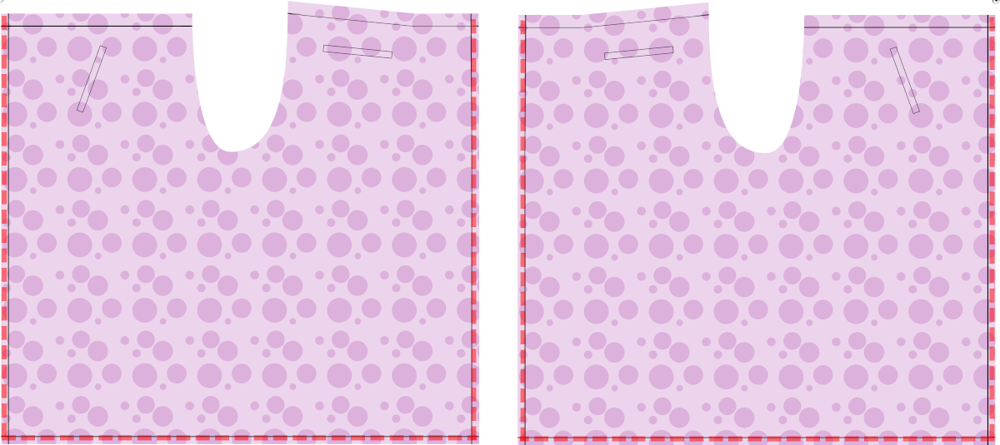

<Tip>

##### Der Schlüssel zu Waralee ist die Taillenband

in gewisser Weise Warale ist nur eine Taillenband mit einem langen Stück Stoff befestigt. Das Taillenband muss aus dem Stoff in zwei Stoffsaiten weitergehen, die die Hosen vorne und hinten binden. Diese Zeichenketten sind nicht im Muster enthalten. Traditionell sind sie ähnlich lang. Sie können längere für die Frontleiste machen (die Seite ist etwas kürzer als die andere, Auf der linken Seite in den Abbildungen unten) können Sie beide Sätze an der Vorderseite binden. Ich bevorzuge dies, da es einfacher ist zu binden, und du hast nicht den Großteil des Knotens im Rücken.

</Tip>

## Schritt 1: Nähen Sie die Taschen

<Note>

##### Taschen sind optional

Traditionell, diese Art von Hosen haben keine Taschen. Aber ich möchte mein Telefon, meine Schlüssel und Brieftasche irgendwo platzieren. Also habe ich Taschen in das Muster aufgenommen. Sie können selbst entscheiden, ob Sie sie auf Ihrer Hose haben möchten.

Die Illustrationen in den nächsten Schritten zeigen die Waralee Hosen ohne Taschen. Es werden nur die Pocket Placements aus dem Muster angezeigt, um Ihnen zu helfen, sich selbst zu orientieren.

##### Wenn du Taschen willst, mache sie zuerst

wenn du die Taschen herstellen willst, machen Sie sie, bevor Sie ein Stück Stoff auf die andere. Es ist einfacher, mit den noch getrennten Teilen zu arbeiten.

</Note>

Wenn gewünscht, nähen Sie die Taschen.

Ich habe Platzierungen für die vorderen Taschen einbezogen, die durch die Klappen in der Vorderseite versteckt werden. Aber sie werden immer noch leicht zugänglich sein, um Ihr Telefon oder Ihre Tasten einzustellen. Das sind Einzelwelttaschen. Die Vorderseite befindet sich in einem Winkel und die Rückseite orientiert sich horizontal. Die Taschenvorlagen sollten genügend Stoff erlauben, um die Tasche an die Taille zu befestigen. Wenn Sie besonders tiefe Taschen wünschen, passen Sie bitte entsprechend an.

## Schritt 2: Hem die Seiten und unten

Hem die Seiten und die Unterseite.

Sie können die beste Methode für Sie verwenden. In der Version, die ich zum ersten Mal gemacht habe, habe ich die Seiten gepackt, sie nach hinten gefaltet und oben geheftet und dann das Gleiche für die untere Seite. Ich habe dies getan, um den Großteil des Stoffes auf ein Minimum zu halten und eine bessere Ziehung zu ermöglichen. Was du tust, sollte von deinem verwendeten Stoff abhängen.

## Schritt 3: Nähen Sie die beiden Teile zusammen im Schnitt

Jetzt kommen Sie zu nähen die beiden Teile zusammen. Lege sie mit *guten Seiten zusammen* und nähe die Naht entlang des Ausschnitts. Beenden Sie die Naht und drücken Sie sie.

## Schritt 4: Bereiten Sie die vier Zeichenketten vor

Die Saiten sind nur lange Rohre aus Stoff.

Nehmen Sie ein Viertel Ihrer Taillenmessung. Fügen Sie diese Zahl auf 40cm hinzu (17”). Fügen Sie Ihre Nahtgenehmigung hinzu. Das ist die Länge jeder Zeichenkette. Schneiden Sie vier Stoffstreifen aus, die so lang und 5cm breit sind.

Zum Beispiel, wenn meine Taillenumfang ist 84,6cm: 84,6cm geteilt durch 4 21,2cm. 21,2cm plus 40cm 61,2cm. 61,2cm plus meine Naht von 1cm ist 62,2cm. Ich werde vier Streifen Stoff schneiden, die 62,2cm um 5cm sind.

<Note>

##### Du kannst die Frontverbindungen

optional verlängern, um die Frontverbindungen zu verlängern, sie um deine Viertel-Taillemessung zu verlängern.

Bei der Generierung Ihres Musters wird eine der Stiloptionen „Taillenband“ genannt. Die Zeichenketten, wenn sie gefaltet sind, sollten die gleiche Breite haben, wie Sie sie für diese Option angegeben haben, standardmäßig 2.5cm (1").

Die extra 40cm (17") Länge ist es, den Knoten herzustellen.

Wenn Ihr Material empfindlich oder fadenscheinig ist, können Sie eine Schnittstelle hinzufügen, um ihm Stärke zu verleihen.

</Note>

Halb entlang der langen Seite einklappen, *gute Seiten zusammen*. Nähen Sie die lange Seite und eine der kurzen Seiten und drehen Sie die Krawatte rechts aus.

<Tip>

##### Das Drehen von Stoffen auf der rechten Seite kann schwierig sein

Das kann erleichtert werden, wenn man ein Stück länger als die Streifen nimmt. Legen Sie das zwischen den rechten Seiten, entlang der Klappe. Vergewissern Sie sich, dass Sie dies beim Nähen der kurzen Seite fangen. Hiermit kannst du das Ende durch die Röhre ziehen, die du erstellt hast. Wenn du fertig bist, kannst du es abschneiden. Ein langer, hässlicher Stock oder ein Schleifenwender kann auch dabei helfen.

</Tip>

## Schritt 5: Nähen der Taillenband

Jetzt ist es an der Zeit, die Taillenband zu nähen. Denken Sie darüber nach, eine Schnittstelle hinzuzufügen, wenn Ihr Stoff zart ist.

Falten Sie die Nahtgenehmigung ein und falten Sie dann entlang der Taillenbandlinie. (rot)

Fügen Sie eine der Zeichenketten ein, die Sie im vorherigen Schritt auf jeder Seite gemacht haben. Nähen Sie die Taillenbandlinie entlang und fügen Sie ein paar zusätzliche Nähte hinzu, um sicherzustellen, dass diese Saiten gut befestigt sind. (blau)

<Tip>

##### Sichern Sie die Zeichenketten gut

Die Zeichenketten halten Ihre Hosen auf, so dass ein Stitchversagen zu schwierigen Momenten führt.

</Tip>

## Schritt 6: Trage deine Hosen

Drücken Sie Ihre Hose, und probieren Sie sie an!

Halten Sie die Vorderseite gegen Ihren Bauch und wickeln Sie beide Saiten um Sie herum und binden Sie im Rücken (oder, Wenn Sie lange Saiten haben, wickeln Sie sie ganz um Sie herum und binden Sie vorne). Dann übergeben Sie sich die Rückseite durch die Beine und binden Sie die anderen Saiten vorne.

Hier ist ein Artikel, der zeigt, wie man die Wickelhose bindet: [Wie man die Hosen umwickeln kann](https://www.wikihow.com/Tie-Wrap-Pants)

Wenn Sie festsitzen oder zusätzliche Fragen haben, können Sie jederzeit [andere FreeSewers](https://discord.freesewing.org/) erreichen.
