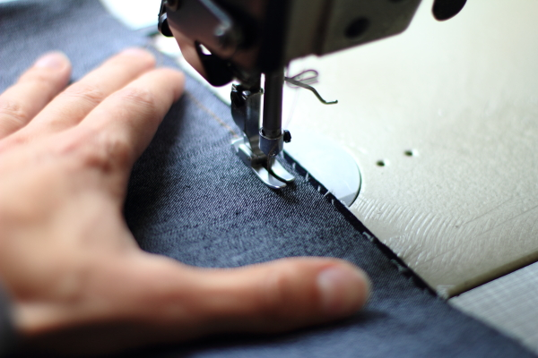

Фраза "лицьові сторони одна до одної" може стосуватися крою чи зшивання:

## Нарізання лицьовими сторонами разом

Вирізання лицьовими сторонами разом - це техніка, яка використовується, коли потрібно вирізати дві однакові або дзеркально відображені деталі.

Якщо викрійка просить вирізати деталь лицьовими сторонами разом, складіть тканину вдвічі: лицьовою стороною/правою стороною тканини всередину, а виворітною стороною/неправою стороною назовні.

Тепер розмітьте викрійку на виворітній стороні тканини і виріжте обидва шари за один раз.

Таким чином, ви отримуєте дві частини, які є дзеркальним відображенням одна одної.

<Note> 

##### Що робити, якщо немає очевидних переваг?

Вирізаючи щось без очевидної "гарної" сторони (наприклад, інтерфейс),
важливо, щоб ви вирізали два дзеркальних шматки, а не два однакових.

</Note>

## Зшивання лицьовими сторонами разом

Зшивання лицьовими сторонами один до одного - це стандартний підхід до виконання шва.

Склавши лицьові сторони тканини разом, обидві деталі будуть з'єднані з припуском на виворітну сторону виробу. Це те, що робиться для переважної більшості швів.

> Коли немає конкретних інструкцій щодо того, як виконати шов, це хороші сторони разом.
